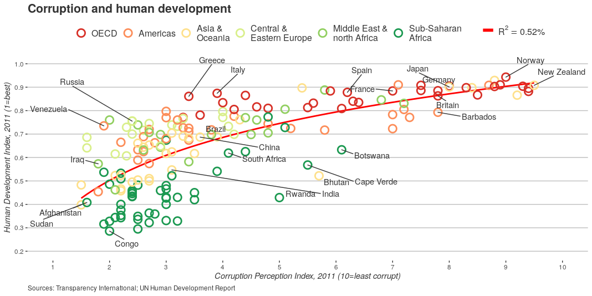
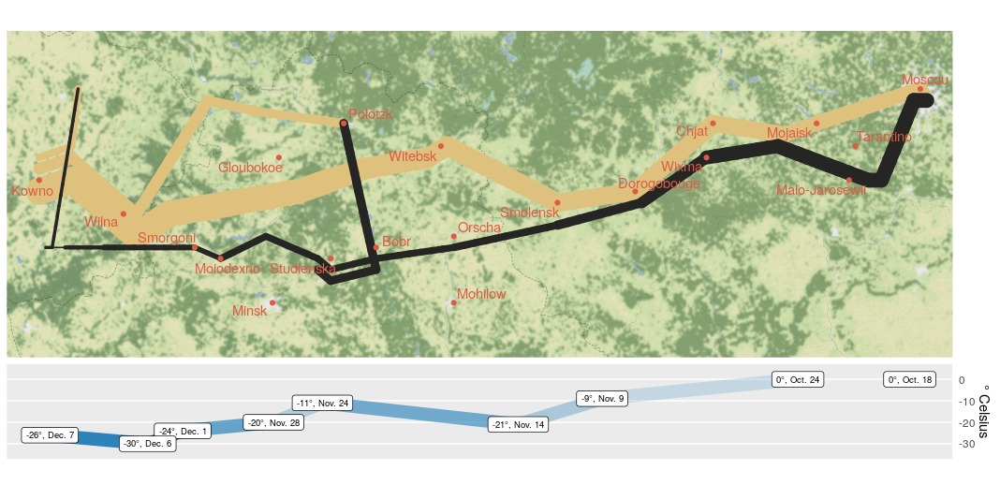
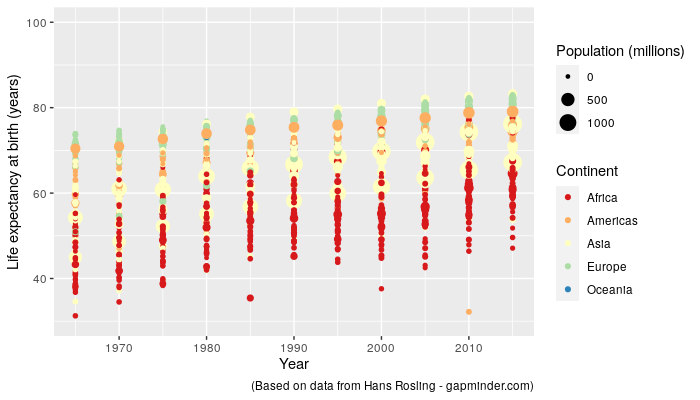
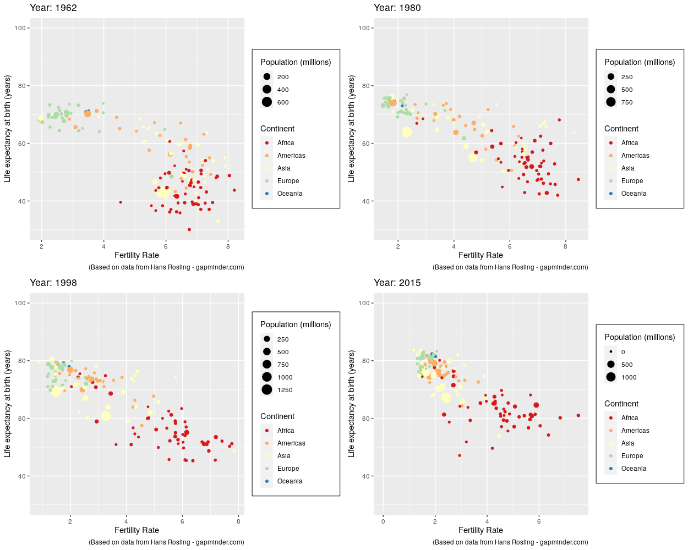

```{r setup, include=FALSE, echo=FALSE}
knitr::opts_chunk$set(echo = TRUE)
knitr::opts_chunk$set(echo = TRUE,
                      fig.retina = 2,
                      tidy.opts=list(width.cutoff = 120),
                      options(width = 120, scipen = 1000))
library(tidyverse)
library(lubridate)
library(ggmap)
library(ggrepel)
library(gridExtra)
library(pander)
library(xlsx)
library(devtools)
library(RCurl)
library(httr)
library(reshape)
library(gapminder)
library(dplyr)
library(gganimate)
library(plotly)
library(gifski)
library(grid)
```

# Problema 1: The Economist

**Resposta:**

<!-- Nesse gráfico a alteração feita foi da paleta de cores, tal paleta foi gerada em https://colorbrewer2.org/ utilizando a configuração "diverging". A alteração da paleta foi motivada pela melhora significativa que traria tanto para a leitura quanto para a estética.\ -->
<!-- Houve uma tentativa de plotar somente os países que estivessem com as labels de nome(como pode ser visto na imagem abaixo), com a intenção de agilizar a leitura e o entendimento. Essa tentativa foi descartada pois ao exibir somente esses países perde-se uma das suas características estruturantes do gráfico: a aglomeração de países da mesma região na distribuição do gráfico. -->

<!--  -->
<!-- \newpage -->
<!-- E aqui temos o resultado final, após a alteração na paleta de cores. -->

<!--  -->

<!-- Segue o código utilizado para gerar o gráfico, que é basicamente o mesmo entregue no trabalho passado. -->

<!-- ```{r, message=FALSE} -->
<!-- dat <- read_csv("./1/EconomistData.csv") -->
<!-- pointsToLabel <- c("Russia", "Venezuela", "Iraq", "Myanmar", "Sudan", -->
<!--                    "Afghanistan", "Congo", "Greece", "Argentina", "Brazil", -->
<!--                    "India", "Italy", "China", "South Africa", "Spane", -->
<!--                    "Botswana", "Cape Verde", "Bhutan", "Rwanda", "France", -->
<!--                    "United States", "Germany", "Britain", "Barbados", "Norway", "Japan", -->
<!--                    "New Zealand", "Singapore") -->
<!-- dat$Region <- factor(dat$Region, -->
<!--                      levels = c("EU W. Europe", -->
<!--                                 "Americas", -->
<!--                                 "Asia Pacific", -->
<!--                                 "East EU Cemt Asia", -->
<!--                                 "MENA", -->
<!--                                 "SSA"), -->
<!--                      labels = c("OECD", -->
<!--                                 "Americas", -->
<!--                                 "Asia &\nOceania", -->
<!--                                 "Central &\nEastern Europe", -->
<!--                                 "Middle East &\nnorth Africa", -->
<!--                                 "Sub-Saharan\nAfrica")) -->

<!-- mR2 <- summary(lm(HDI ~ CPI + log(CPI), data = dat))$r.squared -->
<!-- mR2 <- paste0(format(mR2, digits = 2), "%") -->

<!-- newpalette <- c('#d73027','#fc8d59','#fee08b','#d9ef8b','#91cf60','#1a9850') #Definição -->
<!-- ``` -->

<!-- ```{r, fig.width=10, fig.height=6, warning=FALSE, eval=FALSE} -->
<!-- p <- ggplot(dat, -->
<!--             mapping = aes(x = CPI, y = HDI)) + -->
<!--   geom_smooth(mapping = aes(linetype = "r2"), -->
<!--               method = "lm", -->
<!--               formula = y ~ x + log(x), se = FALSE, -->
<!--               color = "red") + -->
<!--   geom_point(mapping = aes(color = Region), -->
<!--              shape = 1, -->
<!--              size = 4, -->
<!--              stroke = 1.5) + -->
<!--   geom_text_repel(mapping = aes(label = Country, alpha = labels), -->
<!--                   color = "gray20", -->
<!--                   data = transform(dat, -->
<!--                                    labels = Country %in% c("Russia", -->
<!--                                                            "Venezuela", -->
<!--                                                            "Iraq", -->
<!--                                                            "Mayanmar", -->
<!--                                                            "Sudan", -->
<!--                                                            "Afghanistan", -->
<!--                                                            "Congo", -->
<!--                                                            "Greece", -->
<!--                                                            "Argentinia", -->
<!--                                                            "Italy", -->
<!--                                                            "Brazil", -->
<!--                                                            "India", -->
<!--                                                            "China", -->
<!--                                                            "South Africa", -->
<!--                                                            "Spain", -->
<!--                                                            "Cape Verde", -->
<!--                                                            "Bhutan", -->
<!--                                                            "Rwanda", -->
<!--                                                            "France", -->
<!--                                                            "Botswana", -->
<!--                                                            "France", -->
<!--                                                            "US", -->
<!--                                                            "Germany", -->
<!--                                                            "Britain", -->
<!--                                                            "Barbados", -->
<!--                                                            "Japan", -->
<!--                                                            "Norway", -->
<!--                                                            "New Zealand", -->
<!--                                                            "Sigapore"))) + -->
<!--   scale_x_continuous(name = "Corruption Perception Index, 2011 (10=least corrupt)", -->
<!--                      limits = c(1.0, 10.0), -->
<!--                      breaks = 1:10) + -->
<!--   scale_y_continuous(name = "Human Development Index, 2011 (1=best)", -->
<!--                      limits = c(0.2, 1.0), -->
<!--                      breaks = seq(0.2, 1.0, by = 0.1)) + -->
<!--   scale_color_manual(name = "", -->
<!--                      values = newpalette, # Change the color palette -->
<!--                      guide = guide_legend(nrow = 1, order=1)) + -->
<!--   scale_alpha_discrete(range = c(0, 1), -->
<!--                        guide = FALSE) + -->
<!--   scale_linetype(name = "", -->
<!--                  breaks = "r2", -->
<!--                  labels = list(bquote(R^2==.(mR2))), -->
<!--                  guide = guide_legend(override.aes = list(linetype = 1,  -->
<!--                                                           size = 2,  -->
<!--                                                           color = "red"), order=2)) + -->
<!--   ggtitle("Corruption and human development") + -->
<!--   labs(caption="Sources: Transparency International; UN Human Development Report") + -->
<!--   theme_bw() + -->
<!--   theme(panel.border = element_blank(), -->
<!--         panel.grid = element_blank(), -->
<!--         panel.grid.major.y = element_line(color = "gray"), -->
<!--         text = element_text(color = "gray20"), -->
<!--         axis.title.x = element_text(face="italic"), -->
<!--         axis.title.y = element_text(face="italic"), -->
<!--         legend.position = "top", -->
<!--         legend.direction = "horizontal", -->
<!--         legend.box = "horizontal", -->
<!--         legend.text = element_text(size = 12), -->
<!--         plot.caption = element_text(hjust=0), -->
<!--         plot.title = element_text(size = 16, face = "bold")) -->
<!-- p -->
<!-- ``` -->

# Problema 2: Minard

**Resposta:**

<!-- Como dito em sala em sala, esse é um gráfico que não pede mudanças. O efeito que foi proposto seria demonstrar a dramaticidade das baixas temperaturas no caminho de volta. O efeito foi reproduzido configurando o alpha(transparência) na linha que liga as caixas de texto no gráfico de temperaturas. -->

<!-- Aqui o resultado sem o mapa:  -->

<!--  -->

<!-- \newpage -->
<!-- Aqui temos o resultado final: -->

<!--  -->

<!-- Código que gera o gráfico com o mapa: -->

<!-- 1 - Manipulação dos dados. -->

<!-- ```{r, eval=FALSE} -->
<!-- cities <- read.table("./2/cities.txt", -->
<!--                      header = TRUE, stringsAsFactors = FALSE) -->

<!-- troops <- read.table("./2/troops.txt", -->
<!--                      header = TRUE, stringsAsFactors = FALSE) -->

<!-- temps <- read.table("./2/temps.txt", -->
<!--                     header = TRUE, stringsAsFactors = FALSE) %>% -->
<!--   mutate(date = dmy(date)) -->

<!-- normalize <- function(x) {  -->
<!--   ma <- max(x)  -->
<!--   mi <- min(x)  -->
<!--   return ((x-mi)/(ma - mi)) -->
<!-- } -->
<!-- ``` -->

<!-- 2 - Gráfico com mapa. -->

<!-- ```{r, message=FALSE, warning=FALSE, fig.width=10, fig.height=4, eval=FALSE} -->
<!-- march.1812.ne.europe <- c(left = 23.5, bottom = 53.4, right = 38.1, top = 56.3) -->

<!-- march.1812.ne.europe.map <- get_stamenmap(bbox = march.1812.ne.europe, zoom = 8, -->
<!--                                           maptype = "terrain-background", where = "cache") -->

<!-- march.1812.plot <- ggmap(march.1812.ne.europe.map) + -->
<!--   geom_path(data = troops, aes(x = long, y = lat, group = group, -->
<!--                                color = direction, size = survivors), -->
<!--             lineend = "round") + -->
<!--   geom_point(data = cities, aes(x = long, y = lat), -->
<!--              color = "#DC5B44") + -->
<!--   geom_text_repel(data = cities, aes(x = long, y = lat, label = city), -->
<!--                   color = "#DC5B44") + -->
<!--   scale_size(range = c(0.5, 10)) + -->
<!--   scale_colour_manual(values = c("#DFC17E", "#252523")) + -->
<!--   guides(color = FALSE, size = FALSE) + -->
<!--   theme_nothing() -->
<!-- ``` -->

<!-- 3 - Gráfico de temperaturas. -->

<!-- ```{r, fig.width=10, fig.height=4, warning=FALSE, eval=FALSE} -->
<!-- temps.nice <- temps %>% -->
<!--   mutate(nice.label = paste0(temp, "°, ", month, ". ", day)) -->

<!-- temps.nice <- cbind(temps.nice, alpha = normalize(temps.nice$temp)) # normalização das  -->
<!-- #temps para utilização do alpha -->
<!-- temps.1812.plot <- ggplot(data = temps.nice, aes(x = long, y = temp)) + -->
<!--   geom_line(size = 5, color = c("#2b83ba"), alpha = temps.nice$alpha) + # mudança -->
<!--   geom_label(aes(label = nice.label), -->
<!--              size = 2.5) + -->
<!--   labs(x = NULL, y = "° Celsius") + -->
<!--   scale_x_continuous( -->
<!--     limits = ggplot_build(march.1812.plot)$layout$panel_ranges[[1]]$x.range) + -->
<!--   scale_y_continuous(position = "right") + -->
<!--   coord_cartesian(ylim = c(-35, 5)) + -->
<!--   theme(panel.grid.major.x = element_blank(), -->
<!--         panel.grid.minor.x = element_blank(), -->
<!--         panel.grid.minor.y = element_blank(), -->
<!--         axis.text.x = element_blank(), axis.ticks = element_blank(), -->
<!--         panel.border = element_blank()) -->

<!-- temps.1812.plot -->
<!-- ``` -->

<!-- 4 - Junção dos gráficos com `grid`: -->

<!-- ```{r, fig.width=10, fig.height=5.5, warning=FALSE, eval=FALSE} -->
<!-- both.1812.plot <- rbind(ggplotGrob(march.1812.plot), -->
<!--                         ggplotGrob(temps.1812.plot), size="last") -->

<!-- grid::grid.newpage() -->
<!-- grid::grid.draw(both.1812.plot) -->

<!-- # Identificando os paneis do gráfico -->
<!-- panels <- both.1812.plot$layout$t[grep("panel", both.1812.plot$layout$name)] -->

<!-- map.panel.height <- both.1812.plot$heights[panels][1] -->

<!-- # Colocando os painéis no gráfico. -->
<!-- both.1812.plot$heights[panels] <- unit(c(map.panel.height, 0.1), "null") -->

<!-- grid::grid.newpage() -->
<!-- grid::grid.draw(both.1812.plot) -->
<!-- ``` -->

<!-- Vamos gerar agora um gráfico sem o mapa de fundo. Para gerar o gráfico sem o mapa de fundo basta descomentar esse código. -->

<!-- ```{r, fig.width=10, fig.height=4.75, warning=FALSE} -->

<!-- march.1812.plot.simple <- ggplot() + -->
<!--   geom_path(data = troops, aes(x = long, y = lat, group = group, -->
<!--                                color = direction, size = survivors), -->
<!--             lineend = "round") + -->
<!--   geom_point(data = cities, aes(x = long, y = lat), -->
<!--              color = "#DC5B44") + -->
<!--   geom_text_repel(data = cities, aes(x = long, y = lat, label = city), -->
<!--                   color = "#DC5B44") + -->
<!--   scale_size(range = c(0.5, 10)) + -->
<!--   scale_colour_manual(values = c("#DFC17E", "#252523")) + -->
<!--   guides(color = FALSE, size = FALSE) + -->
<!--   theme_nothing() -->

<!-- # Mudanças para que os eixos se coincidam sem o mapa. -->
<!-- temps.1812.plot <- ggplot(data = temps.nice, aes(x = long, y = temp)) + -->
<!--   geom_line(size = 5, color = c("#2b83ba"), alpha = temps.nice$alpha) + -->
<!--   geom_label(aes(label = nice.label), -->
<!--              size = 2.5) + -->
<!--   labs(x = NULL, y = "° Celsius") + -->
<!--   scale_x_continuous(limits = ggplot_build(march.1812.plot.simple)$layout$panel_ranges[[1]]$x.range) + -->
<!--   scale_y_continuous(position = "right") + -->
<!--   coord_cartesian(ylim = c(-35, 5)) +  # Add some space above/below -->
<!--   theme(panel.grid.major.x = element_blank(), -->
<!--         panel.grid.minor.x = element_blank(), -->
<!--         panel.grid.minor.y = element_blank(), -->
<!--         axis.text.x = element_blank(), axis.ticks = element_blank(), -->
<!--         panel.border = element_blank()) -->

<!-- # Juntando os gráficos. -->
<!-- both.1812.plot.simple <- rbind(ggplotGrob(march.1812.plot.simple), -->
<!--                                ggplotGrob(temps.1812.plot), size="last") -->

<!-- # Arrumando novamente a distribuição dos painéis. -->
<!-- panels <- both.1812.plot.simple$layout$t[grep("panel", both.1812.plot.simple$layout$name)] -->

<!-- both.1812.plot.simple$heights[panels] <- unit(c(3, 1), "null") -->

<!-- grid::grid.newpage() -->
<!-- grid::grid.draw(both.1812.plot.simple) -->
<!-- ``` -->

Pronto!

# Problema 3: Gapminder

**Resposta:**

<!-- O proposto para esse problema foi transformar o gráfico animado em algo estático. Algumas possibilidades foram testadas como, por exemplo, passar para o eixo X a sequência de anos.  -->
<!-- Soluções como essa foram descartadas por serem extensas, esteticamente desagradáveis ou nada intuitivas.  -->
<!-- Visto que o objetivo do gráfico original era demonstrar a mudança nos índices com a passagem de anos e a aglomeração de paises da mesma região, pegar representações de anos igualmente espaçados se mostra uma boa maneira de chegar ao desejado.  -->
<!-- A solução apresentada será escolher 4 anos espaçados, recriar o gráfico de cada um desses anos e uni-los em um grid.  -->
<!-- Segue então uma das soluções descartadas e então o resultado final. -->


<!--  -->
<!-- \newpage -->
<!--  -->


<!-- Código que gera o grid: -->

<!-- 1 - Manipulação dos dados: -->

<!-- ```{r, warning=FALSE, eval=FALSE} -->
<!-- population_xls <- read.xlsx("./3/indicator gapminder population.xlsx",  -->
<!--                             encoding = "UTF-8",stringsAsFactors= F, sheetIndex = 1,  -->
<!--                             as.data.frame = TRUE, header=TRUE) -->
<!-- fertility_xls <- read.xlsx("./3/indicator undata total_fertility.xlsx",  -->
<!--                            encoding = "UTF-8",stringsAsFactors= F, sheetIndex = 1,  -->
<!--                            as.data.frame = TRUE, header=TRUE) -->
<!-- lifeexp_xls <- read.xlsx("./3/indicator life_expectancy_at_birth.xlsx",  -->
<!--                          encoding = "UTF-8",stringsAsFactors= F, sheetIndex = 1,  -->
<!--                          as.data.frame = TRUE, header=TRUE) -->

<!-- # Cria uma variável que será usada para filtrar os dados nas linhas a seguir -->
<!-- myvars <- paste("X", 1962:2015, sep="") -->
<!-- # Gera novos dataframes somente com os anos desejados. -->
<!-- population <- population_xls[c('Total.population',myvars)] -->
<!-- fertility <- fertility_xls[c('Total.fertility.rate',myvars)] -->
<!-- lifeexp <- lifeexp_xls[c('Life.expectancy',myvars)] -->
<!-- # Renomeia a primeira coluna dos dataframes com "Country" -->
<!-- colnames(population)[1] <- "Country" -->
<!-- colnames(fertility)[1] <- "Country" -->
<!-- colnames(lifeexp)[1] <- "Country" -->
<!-- # Remove linhas vazias no final do dataframe -->
<!-- lifeexp <- lifeexp[1:275,] -->
<!-- population <- population[1:275,] -->
<!-- # Transforma os dataframes trazendo os anos como coluna -->
<!-- population_m <- melt(population, id=c("Country")) -->
<!-- lifeexp_m <- melt(lifeexp, id=c("Country")) -->
<!-- fertility_m <- melt(fertility, id=c("Country")) -->
<!-- # Renomeia a coluna que mantem os dados -->
<!-- colnames(population_m)[3] <- "pop" -->
<!-- colnames(lifeexp_m)[3] <- "life" -->
<!-- colnames(fertility_m)[3] <- "fert" -->
<!-- # Unifica os dataframes -->
<!-- mydf <- merge(lifeexp_m, fertility_m, by=c("Country","variable"), header =T) -->
<!-- mydf <- merge(mydf, population_m, by=c("Country","variable"), header =T) -->
<!-- # Usando o gapminder para criar um lista com os continentes de cada país do dataframe -->
<!-- continent <- gapminder %>% group_by(continent, country) %>% distinct(country, continent) -->
<!-- continent <- data.frame(lapply(continent, as.character), stringsAsFactors=FALSE) -->
<!-- colnames(continent)[1] <- "Country" -->
<!-- # Retira os paises que não estão presentes na tabela de continentes -->
<!-- mydf_filter <- mydf %>% filter(Country %in% unique(continent$Country)) -->
<!-- # E finalmente adiciona a coluna continentes ao dataframe -->
<!-- mydf_filter <- merge(mydf_filter, continent, by=c("Country"), header =T) -->
<!-- #Remove as linhas com valores "N/A", retorna as strings para o formato "character"  -->
<!-- #e converte os dados para o formato numérico. -->
<!-- mydf_filter[is.na(mydf_filter)] <- 0 -->
<!-- mydf_filter <- data.frame(lapply(mydf_filter, as.character), stringsAsFactors=FALSE) -->
<!-- mydf_filter$variable <- as.integer(as.character(gsub("X","",mydf_filter$variable))) -->
<!-- colnames(mydf_filter)[colnames(mydf_filter)=="variable"] <- "year" -->
<!-- mydf_filter$pop <- round(as.numeric(as.character(mydf_filter$pop))/1000000,1) -->
<!-- mydf_filter$fert <- as.numeric(as.character(mydf_filter$fert)) -->
<!-- mydf_filter$life <- as.numeric(as.character(mydf_filter$life)) -->
<!-- ano <- mydf_filter[mydf_filter$year == 1962,] -->
<!-- ano2 <- mydf_filter[mydf_filter$year == 1980,] -->
<!-- ano3 <- mydf_filter[mydf_filter$year == 1998,] -->
<!-- ano4 <- mydf_filter[mydf_filter$year == 2015,] -->
<!-- ``` -->
<!-- 2 - Criação dos gráficos e união. -->
<!-- ```{r, warning=FALSE, eval = FALSE, fig.height=20, fig.width = 25} -->
<!-- # Criação de um tema global para o ggplot -->
<!-- theme_set(theme_grey()+ theme(legend.box.background = element_rect(),legend.box.margin = margin(6, 6, 6, 6)) ) -->
<!-- p <- ggplot(ano, aes(fert, life, size = pop, color = continent)) + -->
<!--   labs(x="Fertility Rate", y = "Life expectancy at birth (years)",  -->
<!--        caption = "(Based on data from Hans Rosling - gapminder.com)",  -->
<!--        color = 'Continent',size = "Population (millions)") + -->
<!--   ylim(30,100) + -->
<!--   geom_point() + -->
<!--   scale_color_brewer(type = 'div', palette = 'Spectral') + -->
<!--   ggtitle("Year: 1962") -->

<!-- p2 <- ggplot(ano2, aes(fert, life, size = pop, color = continent)) + -->
<!--   labs(x="Fertility Rate", y = "Life expectancy at birth (years)",  -->
<!--        caption = "(Based on data from Hans Rosling - gapminder.com)",  -->
<!--        color = 'Continent',size = "Population (millions)") + -->
<!--   ylim(30,100) + -->
<!--   geom_point() + -->
<!--   scale_color_brewer(type = 'div', palette = 'Spectral') + -->
<!--   ggtitle("Year: 1980") -->

<!-- p3 <- ggplot(ano3, aes(fert, life, size = pop, color = continent)) + -->
<!--   labs(x="Fertility Rate", y = "Life expectancy at birth (years)",  -->
<!--        caption = "(Based on data from Hans Rosling - gapminder.com)",  -->
<!--        color = 'Continent',size = "Population (millions)") + -->
<!--   ylim(30,100) + -->
<!--   geom_point() + -->
<!--   scale_color_brewer(type = 'div', palette = 'Spectral') + -->
<!--   ggtitle("Year: 1998") -->

<!-- p4 <- ggplot(ano4, aes(fert, life, size = pop, color = continent)) + -->
<!--   labs(x="Fertility Rate", y = "Life expectancy at birth (years)",  -->
<!--        caption = "(Based on data from Hans Rosling - gapminder.com)",  -->
<!--        color = 'Continent',size = "Population (millions)") + -->
<!--   ylim(30,100) + -->
<!--   geom_point() + -->
<!--   scale_color_brewer(type = 'div', palette = 'Spectral') + -->
<!--   ggtitle("Year: 2015") -->

<!-- #grid.arrange(p, p2, p3, p4, nrow = 2, ncol = 2) -->
<!-- # Juntando os gráficos. -->
<!-- p12 <- cbind(ggplotGrob(p), -->
<!--               ggplotGrob(p2), size="last") -->
<!-- p34 <- cbind(ggplotGrob(p3), -->
<!--               ggplotGrob(p4), size="last") -->

<!-- allp <- rbind(p12, p34, size="last") -->

<!-- # Arrumando novamente a distribuição dos painéis. -->
<!-- panels <- p$layout$t[grep("panel", allp$layout$name)] -->

<!-- allp$heights[panels] <- unit(c(3, 1), "null") -->

<!-- grid::grid.newpage() -->
<!-- grid::grid.draw(allp) -->
<!-- ``` -->

# Problema 4: Atirei o pau no gráfico

<!-- Assista o vídeo [https://www.youtube.com/watch?v=CJkzf4IZRuk] em que o autor realiza um gráfico em Excel. Seguindo os mesmos passos, faça esse gráfico em R. -->

<!-- **Resposta:** -->

<!-- Vamos começar importando a tabela baixada no painel oficial do covid e já criando um dataframe somente com os dados que usarei para replicar. -->

<!-- ```{r, warning=FALSE, error=FALSE} -->
<!-- covid <- read.xlsx("./4/dados.xlsx", encoding = "UTF-8",stringsAsFactors= F, sheetIndex = 1, as.data.frame = TRUE, header=TRUE) -->
<!-- covid <- data.frame(date = covid$data, obitos = covid$obitosAcumulado) -->
<!-- ``` -->

<!-- Como escrevi o código em um único chunk vou novamente comentar dentro desse chunk.  -->
<!-- O primeiro diz respeito a gráfico dos 14 minutos, que representa a quantidade de óbitos em escala logarítmica. -->

<!-- ```{r, warning = FALSE, message= FALSE} -->
<!-- # Aqui é feita a remoção das linhas cujos número de óbitos é 0 e a criação de um vetor que auxiliará no cálculo da taxa. -->
<!-- obitos <- covid$obitos -->
<!-- obitos <- obitos[obitos != 0] -->
<!-- obitos_help <- c(0 ,obitos) -->
<!-- obitos <- c(obitos, 0) -->
<!-- # Cálculo da taxa -->
<!-- taxa <- obitos / obitos_help -->
<!-- taxa[taxa == Inf] <- 0 -->
<!-- # Criação de um dataframe com as datas, os óbitos e as taxas já calculadas. -->
<!-- full <- cbind(data.frame(obitos, taxa)[-c(58),], date = ymd(covid$date[covid$obitos != 0])) -->
<!-- # Filtragem desse dataframe para as datas utilizadas no video. -->
<!-- newdf <- full[full$date >= "2020-03-27" & full$date <= "2020-04-14",] -->
<!-- # Criação dos estilos a serem utilizados no gráfico, as listas a seguir dizem respeito respectivamente ao eixo principal(em escala logarítmica) que está ligado aos óbitos e ao eixo secundário(em escala linear) que está ligado a taxa de crescimento. -->
<!-- style.atirei1y1 <- list( -->
<!--   autotick = FALSE, -->
<!--   type = "log", # Transforma o eixo para a escala logarítmica -->
<!--   ticks = "outside", -->
<!--   tick0 = 10, -->
<!--   tickwidth = 2, -->
<!--   tickcolor = toRGB("blue"), -->
<!--   title = "" -->
<!-- ) -->
<!-- style.atirei1y2 <- list( -->
<!--   autotick = FALSE, -->
<!--   ticks = "outside", -->
<!--   tick0 = 0.8, -->
<!--   dtick = 0.05, -->
<!--   ticklen = 1.5, -->
<!--   tickwidth = 1, -->
<!--   tickcolor = toRGB("blue"), -->
<!--   side = "right", -->
<!--   overlaying = "y" -->
<!-- ) -->
<!-- # Utilizando o plotly, defini um gráfico com eixo x sendo as datas. -->
<!-- atirei1 <- plot_ly(x = ~newdf$date) -->
<!-- # Adicionando a linha de óbitos. -->
<!-- atirei1 <- atirei1 %>% add_trace(y = ~newdf$obitos, name = "Óbitos", mode = "lines+markers", line = list(shape = "spline", width = 2)) -->
<!-- # Adicionando a linha de taxa de crescimento e a ligando ao eixo secundário(yaxis = "y2"), assim a mesma se manterá em escala linear -->
<!-- atirei1 <- atirei1 %>% add_trace(y =  ~newdf$taxa, name = "Taxa de crescimento", mode = "lines+markers", line = list(width = 2), yaxis = "y2") -->
<!-- # Aplicação dos estilos citados acima, adição do título, movimentação da legenda para a parte inferior. -->
<!-- atirei1 <- atirei1 %>% layout(xaxis = list(title = ""),yaxis = style.atirei1y1, yaxis2 = style.atirei1y2, title = "Óbitos COVID-19 no Brasil",legend = list(orientation = "h"), margin = list(r = 50)) -->
<!-- # Exibição do gráfico -->
<!-- atirei1 -->
<!-- ``` -->

<!-- Reconstrução da tabela de previsão de número de óbitos:  -->

<!-- ```{r, warning = FALSE, message=FALSE} -->
<!-- # Criando o vetor da soma acumulada dos desvios. -->
<!-- media <- 1.1 -->
<!-- somaaculmulada <- newdf$taxa - media -->
<!-- # Plotando a soma e assim verificando a média. -->
<!-- soma <- plot_ly(x = ~newdf$date) -->
<!-- soma <- soma %>% add_trace(y = ~somaaculmulada, name = "Soma", mode = "lines+markers") -->
<!-- soma <- soma %>% layout(yaxis = list(tick0 = -1, dtick = 0.1, ticklen = 1)) -->
<!-- soma -->
<!-- ``` -->

<!-- Agora a tabela de previsão: -->

<!-- ```{r} -->
<!-- # Função para gerar a previsão dos óbitos com base na taxa de crescimento média -->
<!-- simulacrescimento <- function(taxa, valor_inicial, dias){ -->
<!--   sup <- c() -->
<!--   for(i in 1:dias){ -->
<!--     sup <- c(sup, round(valor_inicial * (taxa ^ i))) -->
<!--   } -->
<!--   sup -->
<!-- } -->
<!-- # Preparando as datas a serem adicionadas no dataframe(restante do mês de abril) -->
<!-- newdates <- seq(as.Date("2020-04-15"), as.Date("2020-04-30"), by="days") -->
<!-- newdates <- c(newdf$date, newdates) -->
<!-- # Contagem dos dias que foram adicionados -->
<!-- diasadicionados <- length(newdates) - length(newdf$date) -->
<!-- # Preparando as taxas a serem adicionadas no dataframe(supondo 1.1 no restante do mês de abril) -->
<!-- taxa <-  rep(1.1, times = diasadicionados) -->
<!-- newtaxa <- c(newdf$taxa, taxa) -->
<!-- # Criação do vetor com os óbitos já registrados e com a previsão. -->
<!-- newobitos <- c(newdf$obitos, simulacrescimento(media, tail(newdf$obitos, n = 1), diasadicionados)) -->
<!-- # União das novas unidades em um dataframe. -->
<!-- tabela <- data.frame(Data = newdates, obitos = newobitos, taxa = newtaxa) -->

<!-- knitr::kable(tabela) -->
<!-- ``` -->

<!-- A previsão feita diz 7039 óbitos até o final do mês de abril. Isso nos mostra que essa taxa na realidade abaixou de 1.1, no final de abril foram registrados pelas secretárias estaduais de saúde 5912 óbitos. -->
